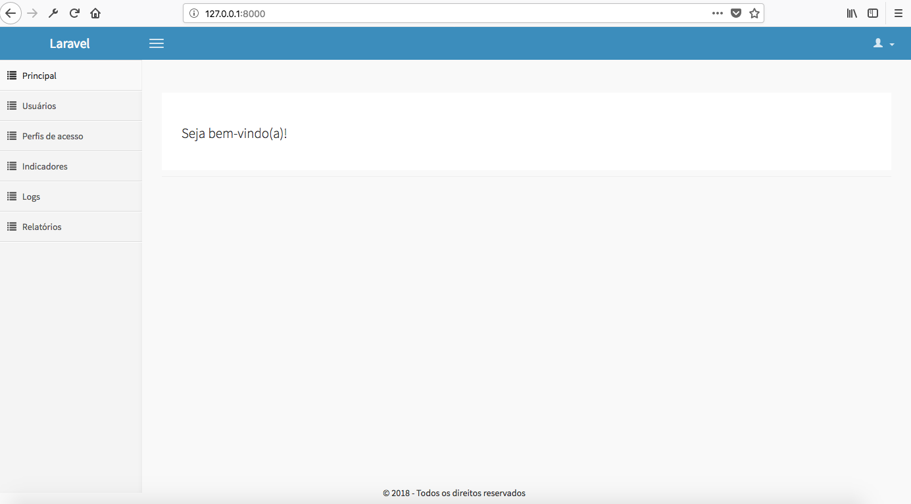

## Laravel admin

Painel admin para controle de usuários, gerenciamento de perfis de acesso, permissões, relatórios, indicadores e logs.
Além desses módulos, já está implementado um sistema de autenticação, cadastro de novos usuários e recuração de senha.



## Installation

- Clone repository
```
$ git clone git@github.com:mffonseca/laravel-admin.git
```

- Access directory
```
$ cd laravel-admin
```

- Copy `.env.example` to `.env` and add your configs
```
$ cp .env.example .env
```

- Install PHP dependencies ([composer](http://getcomposer.org))
```
$ composer install
```

- Generate new key
```
$ php artisan key:generate
```

- Configure your database access
```
$ vim .env
```

- Run artisan commands.
```
$ php artisan migrate --seed && php artisan db:seed
```

## Run tests
```
$ ./vendor/bin/phpunit 
```

## Server start

- Open new terminal
```
$ php artisan serve
```

- *user: meusistema@rizer.com.br
- *password: admin